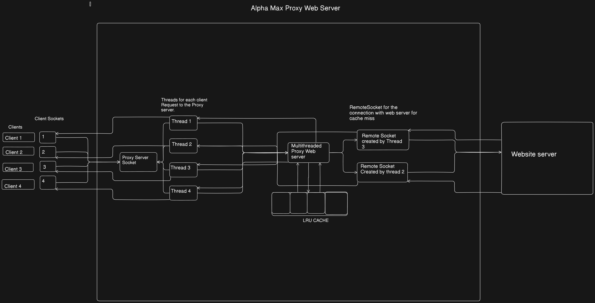

Multi-Threaded Proxy Server with Caching
This project implements a multi-threaded proxy server in C, designed to handle multiple client requests concurrently, cache responses for quick retrieval, and manage access through synchronization mechanisms like semaphores.

High Level Design:-

Limitations
Cache Redundancy: If a URL opens multiple clients simultaneously, each client’s response is cached separately, which can fragment responses.
Fixed Cache Size: Larger websites may not fit into the cache.

Future Extensions
Multiprocessing: The proxy could be enhanced to use multiprocessing for better performance.
Advanced Access Control: Specify which types of websites should be allowed.
Extended Request Handling: Implement additional HTTP methods like POST.
